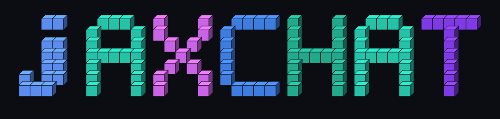
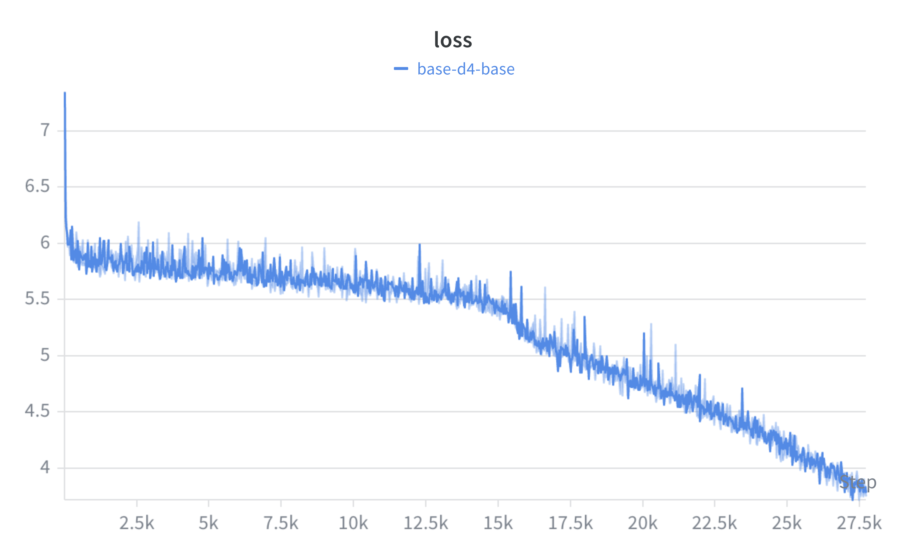
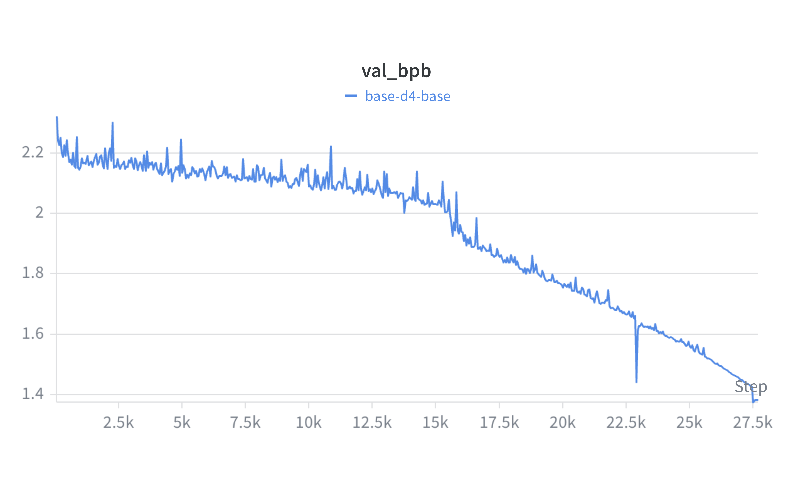
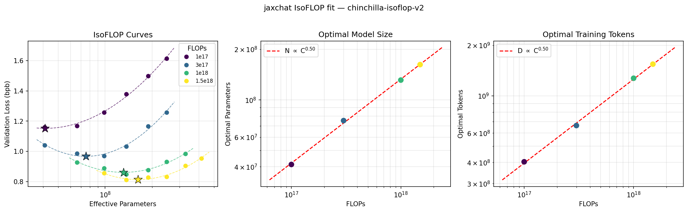
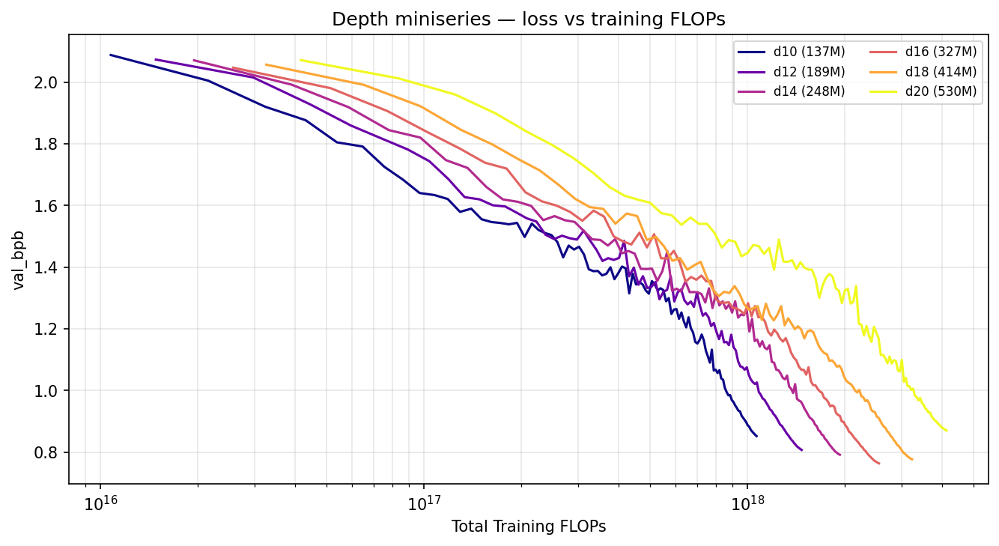

<p align="center">
  
</p>

# jaxchat

A from-scratch JAX implementation of a small GPT-style chatbot, trained end-to-end:
tokenizer → base pretraining → SFT → GRPO RL → eval → inference. The full pipeline
runs on a single H100 or RTX 6000 in a few hours and produces a checkpoint you can
chat with from a CLI or a small FastAPI web UI.

## Pipeline

`runs/speedrun_d4.sh` chains nine stages, each a separate entry point under
`scripts/`. Earlier stages are skipped on rerun if their outputs already exist
under `data/d4_speedrun/`.

| # | Stage | Script | Notes |
|---|-------|--------|-------|
| 1 | Tokenizer | `scripts.tok_train` | BPE, vocab=8192, trained on FineWeb-Edu |
| 2 | Pack corpus | `data.cached_fineweb` | 150M train / 1M val tokens |
| 3 | Base pretraining | `scripts.base_train` | preset `d4` (~10M params) |
| 4 | Base eval | `scripts.base_eval` | BPB + CORE-subset (n=200) |
| 5 | SFT data | `dev.synth_smoltalk` | 5k synthetic chat rows |
| 6 | SFT | `scripts.chat_sft` | 400 iters, seq_len=1024 |
| 7 | Chat eval | `scripts.chat_eval` | CORE-subset + GSM8K (n=50) |
| 8 | RL data + GRPO | `dev.synth_gsm8k`, `scripts.chat_rl` | 60 iters, M=4 G=4 |
| 9 | Final chat eval | `scripts.chat_eval` | with GSM8K (n=100) |

Loss curves and eval metrics are logged to Weights & Biases under the project
`jaxchat`. Sample run from a `d4` (~11.5M-param) base pretrain over ~27.7k steps
on a single H100:

<p align="center">
  
  
</p>

Training loss drops from ~7.0 to ~3.8; validation BPB from ~2.3 to ~1.4.

## Scaling: Chinchilla IsoFLOP sweep

To pick model/data sizes we ran a Chinchilla-style IsoFLOP study (30 runs on
8x RTX 6000 Ada): at each compute budget C ∈ {1e17, 3e17, 1e18, 1.5e18} FLOPs
we trained a range of depths, fit a parabola in log10(N) to find the
compute-optimal model size N\* per budget (with D\* = C / 6N\*), then fit
power laws across budgets:

> **N\* ∝ C^0.50  D\* ∝ C^0.50** — textbook Chinchilla
> (Hoffmann et al. 2022 report 0.49/0.51).

<p align="center">
  
</p>

A depth miniseries (d10–d20, 137M→530M params, 1.31B tokens each on FineWeb)
tracks loss and a 4-task CORE-style eval (ARC-E/C, HellaSwag, PIQA) across
scale; depth 16 (327M) is the family's best val_bpb at 0.7626:

<p align="center">
  
</p>
<p align="center">
  
</p>

Reproduce with `runs/rtx_8gpu_chinchilla_isoflop.sh` (sweep) and
`scripts/fit_chinchilla.py` (fits + plots).

## Results

Beyond the `d4` speedrun, the same stack scales up. The largest run to date is a
**0.5B** Chinchilla-optimal model (`124m-modern` preset at depth 20: d_model
1280, vocab 32,768, seq 1024, 529.5M params), pretrained on ~5.0B tokens
(Tokens:Params ≈ 9.5, from the IsoFLOP fit), then SFT'd:

| Stage | val_bpb | CORE (mean acc, 4 tasks) | Notes |
|-------|--------:|-------------------------:|-------|
| Base (529.5M, ~5.0B tok) | **0.4786** | 0.360 | arc_e 0.330 · arc_c 0.247 · hellaswag 0.289 · piqa 0.574 |
| + SFT (4k steps) | — | 0.364 | arc_e 0.349 · arc_c 0.254 · hellaswag 0.295 · piqa 0.556 |

SFT also adds chat/instruction behavior; downstream generative evals at this
scale are still ~0 (gsm8k, humaneval) and MMLU is near chance (0.265), as
expected for a 0.5B base. CORE bits-per-byte here is on the 0.5B preset's own
65k-vocab validation set and is **not** comparable to the 124m-family `val_bpb`
(0.7626 at depth 16) — different tokenizer and val set.

The GRPO/RL stage of the chain is memory-bound at this size: the loss
materializes several full `(B, T, vocab)` logits-sized tensors at once — policy
and reference logits plus their softmax/backward — which at depth 20 / vocab 32k
/ batch `M*G` exceeded 34 GiB and OOM'd the first GRPO step. `scripts/chat_rl.py`
keeps this in check by (1) cropping each batch to its actual sequence length
(bucketed, mesh-divisible) instead of padding to `max_seq_len`, and (2) computing
the frozen reference log-probs in a separate pass so only one logits tensor is
live during the differentiated update.

## Layout

```
jaxchat/      model, attention, tokenizer, engine, checkpoint, presets
training/     pretraining loop, eval routines (used by scripts/)
scripts/      entry points: tok_train, base_train, base_eval,
              chat_sft, chat_eval, chat_rl, chat_cli, chat_server
data/         FineWeb caching + token packing
dev/          synthetic SFT (smoltalk) and RL (GSM8K) data generators
tasks/        eval harness (arc_easy, hellaswag, piqa, gsm8k, core)
runs/         SLURM launchers (h100_d4.sh, rtx_d4.sh) + speedrun_d4.sh
tests/        pytest suite (engine smoke, sft masking, training stack, ckpt)
```

`ablation_notes.md` tracks ideas under consideration and ones already ruled out.

## Replication

Prereqs: Python 3.12, [`uv`](https://github.com/astral-sh/uv), a CUDA GPU.

```bash
git clone git@github.com:ibusnowden/jaxchat.git
cd jaxchat
uv sync
```

Set wandb credentials once (either in `~/.netrc` via `wandb login`, or export
`WANDB_API_KEY`). The launchers default to `WANDB_PROJECT=jaxchat`.

Run the full pipeline:

```bash
# SLURM (single GPU)
sbatch runs/h100_d4.sh        # 1 x H100 80GB
sbatch runs/rtx_d4.sh         # 1 x RTX 6000

# Or directly on a node with a GPU visible
bash runs/speedrun_d4.sh
```

Outputs land in `data/d4_speedrun/`:

```
tokenizer/                # vocab + merges
fineweb8k/                # packed *.bin shards
runs/{base,sft,rl}/       # checkpoints, logs
```

## Inference

After the pipeline finishes (or after any of stages 3, 6, 8), point either
client at the matching run directory:

```bash
# Terminal REPL
python -m scripts.chat_cli --run-dir data/d4_speedrun/runs/rl

# FastAPI web UI on http://localhost:8000
python -m scripts.chat_server --run-dir data/d4_speedrun/runs/rl --port 8000
```

The web UI exposes `POST /chat` (`{messages, max_new_tokens?, temperature?, top_k?, top_p?, seed?}` → `{reply}`), plus `GET /health` and a minimal HTML chat page at `/`.

## Tests

```bash
uv run pytest tests/
```
